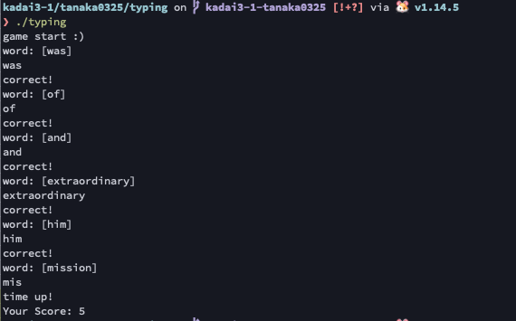
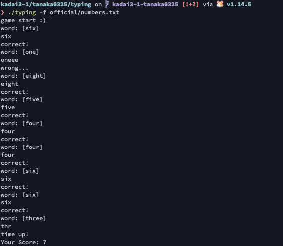

# 課題3-1 【TRY】タイピングゲームを作ろう

## 内容

- 標準出力に英単語を出す（出すものは自由）
- 標準入力から1行受け取る
- 制限時間内に何問解けたか表示する

## 遊び方

```
# ビルド
$ cd typing
$ go build -o typing ./cmd/typing

# 起動
$ ./typing

# ゲーム時間変更（秒数指定）
$ ./typing -t 5
$ ./typing --time 5

# 単語リスト指定
$ ./typing -f official/numbers.txt
$ ./typing --file official/holms.txt
```

## プレイ画像

### デフォルト



### 数字


